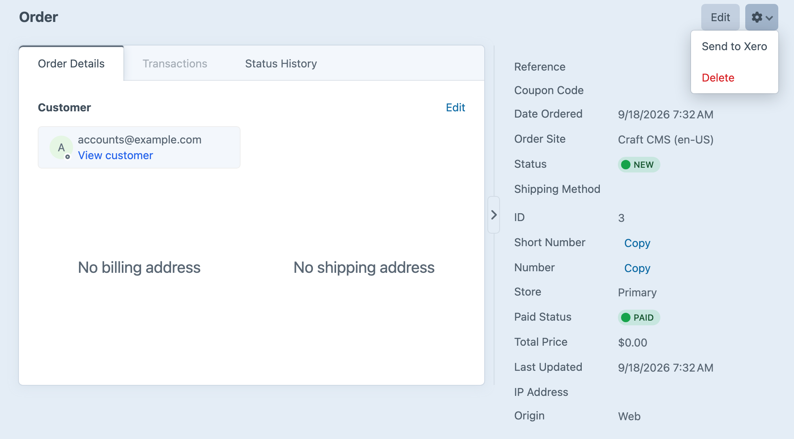
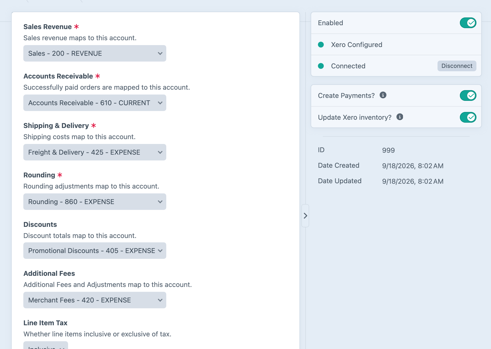

<!-- feature-intro -->
Xero connects Craft Commerce orders with the accounting workflow in Xero. Create or match contacts, send invoices and payments, and keep product inventory updates moving without re-entering each sale.
<!-- feature-intro-end -->

<!-- feature-section media-size="large" -->
## Commerce orders to Xero

Map an eligible Craft Commerce order to a Xero invoice with its customer, line items, totals, tax, and payment information. The integration can create the contact when required or match an existing Xero record.

<!-- feature-section-end -->

<!-- feature-section media-size="large" -->
## Accounting mappings

Connect the appropriate Xero organisation and map accounts, tax rates, statuses, and inventory behaviour to the store. Multiple organisations can serve different accounting arrangements, while manual and console actions give staff a way to resend or deliberately trigger an order. Plugin events provide extension points when a project needs to adjust contacts, invoices, payments, or item data.

<!-- feature-section-end -->
